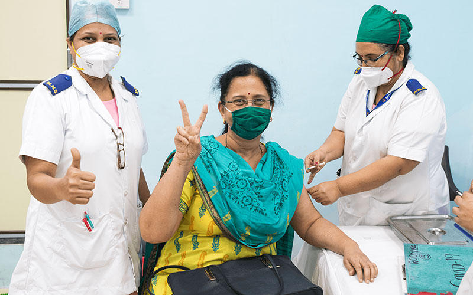

# Introduction to DIVOC

## What is DIVOC?

The <mark style="color:orange;">**Digital Infrastructure**</mark>** for Vaccination Open Credentialing** or <mark style="color:orange;">**DI**</mark>**VOC** is an **open-source platform** that enables countries to digitally orchestrate large-scale health campaigns such as vaccination and certification programs.

Learn more about the platform on the [**DIVOC**](https://divoc.dev) website **** or **** [**Contact us**](https://divoc.dev/#get-in-touch) **** for more details.

## **Facilitates last-mile delivery of health programs at scale**

* Built in India for the world as a <mark style="color:orange;">**digital public good**</mark>, DIVOC is a flexible and extendable software that can be used across multiple health programs.
* Its scalable and data-driven architecture allows it to deal with diverse country-specific scenarios. In a vaccination program, for example, it gives countries the ability to manage and control vaccines, facilities, and vaccinators systematically across geographies, as well as generate digitally variable certificates that are compliant with international standards.

## **Our Key Modules**

* The platform is modular, enabling countries to use the components together or as an individual standalone solution, according to their need, for end-to-end vaccination and certification.
* DIVOC has two core modules:

&#x20;            1\. Issue and Verify Certificates

&#x20;            2\. Analytics

* Reference Implementation: There are other components of DIVOC that countries can customise according to their requirement -&#x20;

&#x20;             1\. Program setup via the orchestration module

&#x20;             2\. Facility app

&#x20;             3\. Citizen portal

&#x20;             4\. Feedback        &#x20;

* <mark style="color:orange;">**DIVOC Demo**</mark>**:** Click [<mark style="color:orange;">**here**</mark>](divoc-demo/) to play around with the modules.

## **DIVOC’s journey so far: Country stories**

Being deployed across multiple countries, the platform has enabled India to issue over 1 billion COVID-19 vaccination certificates to its citizens.

|                                                            Launched at Scale: India                                                                                                       |                                                                                                                                                                                                             Now live in…                                                                                                                                                                                                            |                                                                                Coming soon…                                                                               |
| :---------------------------------------------------------------------------------------------------------------------------------------------------------------------------------------: | :---------------------------------------------------------------------------------------------------------------------------------------------------------------------------------------------------------------------------------------------------------------------------------------------------------------------------------------------------------------------------------------------------------------------------------: | :-----------------------------------------------------------------------------------------------------------------------------------------------------------------------: |
|                                          <mark style="color:orange;">**1.1 billion**</mark> digitally signed vaccinated certificates via Cowin.                                           | 
DIVOC’s certificate component went 

live with digital vaccination certificates 

in <mark style="color:orange;"><strong>Sri Lanka</strong></mark> in July 2021, in the <mark style="color:orange;"><strong>Philippines</strong></mark> in September 2021, and in <mark style="color:orange;"><strong>Jamaica</strong></mark> and <mark style="color:orange;"><strong>Indonesia</strong></mark> in December 2021. 
 | <mark style="color:orange;">**Indonesia**</mark> and <mark style="color:orange;">**Jamaica**</mark> are currently planned for Covid-19 vaccination certificate roll-outs. |
| 
DIVOC has enabled the Indian Council of Medical Research (ICMR) to 

issue digitally-signed 

<mark style="color:orange;"><strong>COVID-19 test reports</strong></mark>.
 |                                                                                                                            Plans are underway to issue COVID-19 test result certificates in both <mark style="color:orange;">**Sri Lanka**</mark> and <mark style="color:orange;">**Philippines**</mark>.                                                                                                                           |                                                                  <mark style="color:orange;">****</mark>                                                                  |

__

_All content on this page by_ [_eGov Foundation_ ](https://egov.org.in)_is licensed under a_ [_Creative Commons Attribution 4.0 International License_](http://creativecommons.org/licenses/by/4.0/)_._
